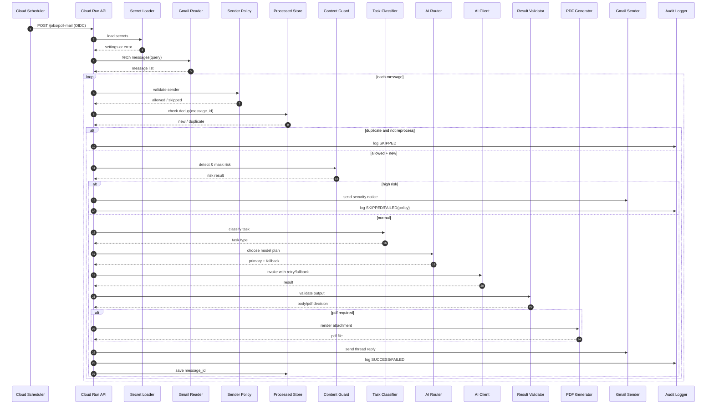

# 메일 업무지시 비서 시스템 개발 착수/검증/배포 실행서 (v1.1)

## 0. 목적
본 문서는 개발 착수 전에 반드시 확정해야 하는 다음 4종 산출물을 통합 정리한다.
1) 아키텍처 설계서
2) 프로세스 설계서
3) 시퀀스 다이어그램
4) 사용 스킬(기술) 정의서

또한 개발 완료 후 요구된 검증(파일럿 4회 + 전수 4회)과 이상 없을 시 GitHub 업로드 및 수동 작업 절차까지 포함한다.

---

## 1. 아키텍처 설계서

### 1.1 논리 아키텍처
- Trigger: Cloud Scheduler(OIDC)
- Runtime: Cloud Run(FastAPI)
- Config/Secret: Secret Manager
- Mail I/O: Gmail API(OAuth refresh token)
- AI: OpenAI / Claude / Gemini (라우터 기반)
- Storage: Processed Message Store(Firestore 권장)
- Logging/Audit: Cloud Logging + 구조화 감사로그
- Artifact: PDF Generator(한글 폰트 포함)

### 1.2 컴포넌트 분해
- `app/main.py`: API 엔드포인트(`/health`, `/jobs/poll-mail`, `/jobs/reprocess`, `/version`)
- `config/secret_loader.py`: Secret 조회/검증
- `mail/gmail_reader.py`: 미처리 메일 조회
- `mail/sender_policy.py`: 허용 발신자 검증
- `security/pii_detector.py`: 민감정보 탐지
- `security/masking_service.py`: 마스킹
- `ai/model_router.py`: 모델 선택 및 fallback
- `output/mail_body_builder.py`: 1,000자 이하 본문 생성
- `output/pdf_generator.py`: 조건부 PDF 생성
- `mail/gmail_sender.py`: thread reply + 첨부 발송
- `audit/audit_logger.py`: SUCCESS/FAILED/SKIPPED
- `audit/processed_store.py`: 중복 방지(message_id)

### 1.3 비기능 요구사항
- 보안: High risk는 외부 AI 호출 차단
- 성능: Scheduler 1회 처리당 `POLL_MAX_RESULTS` 제한
- 신뢰성: 모델/API 실패 시 retry + fallback
- 추적성: message_id 단위 감사로그
- 운영성: `/health`, `/version`로 상태 확인

### 1.4 권한/IAM
- Cloud Run Runtime SA: Secret Accessor 최소 권한
- Cloud Scheduler SA: Cloud Run Invoker만
- 배포 계정/운영 계정 분리
- unauthenticated 호출 금지

---

## 2. 프로세스 설계서

### 2.1 표준 처리 플로우
1. Scheduler가 `/jobs/poll-mail` 호출
2. Secret 로딩 실패 시 즉시 종료(메일 처리 금지)
3. GmailReader가 신규 메일 조회
4. SenderPolicy로 허용 발신자 검증
5. 중복(message_id) 검증 (재처리 태그 예외)
6. 명령 파싱(제목/본문/첨부 메타)
7. 보안 탐지(PII/금융/인증/내부정보)
8. High risk면 외부 전송 차단 + 보안 안내 회신
9. Task 분류 및 모델 라우팅
10. 모델 호출(재시도/fallback)
11. 결과 검증(금지문구/길이/코드 포함)
12. PDF 필요 여부 판단 및 생성
13. 메일 회신(thread 유지)
14. 감사로그 기록 및 message_id 저장

### 2.2 예외 처리 프로세스
- Secret 조회 실패: `FAILED`, 후속 처리 중단
- Gmail 오류: 지수 백오프 후 실패 기록
- AI 전 모델 실패: 실패 회신 또는 운영로그
- PDF 생성 실패: 본문 최소 요약 + 실패로그
- 미허용 발신자: `SKIPPED` 기록만

### 2.3 운영 제어 포인트
- `/jobs/reprocess`: 관리자 전용 재처리
- `ALLOWED_COMMAND_SENDERS` 운영 중 변경 가능
- 민감정보 룰셋 주기적 업데이트
- 금지 문구 룰셋 운영 관리

---

## 3. 시퀀스 다이어그램

---

## 4. 사용 스킬(기술) 정의서

### 4.1 Backend/Core
- Python 3.11+
- FastAPI
- Pydantic Settings
- httpx(외부 API 통신)
- tenacity(retry/backoff)

### 4.2 Google Cloud
- Cloud Run
- Cloud Scheduler (OIDC)
- Secret Manager
- Cloud Logging
- Firestore(선택: dedup 저장)

### 4.3 Mail/문서
- Gmail API (google-api-python-client)
- OAuth2 Credentials
- PDF 라이브러리(ReportLab 또는 WeasyPrint)
- 한글 폰트(Noto Sans CJK)

### 4.4 품질/테스트
- pytest
- pytest-mock
- coverage
- ruff(정적 검사)

### 4.5 보안/운영
- 정규식 기반 PII/Secret 탐지
- 마스킹 정책 엔진
- 구조화 감사로그(JSON)

---

## 5. 효율적 업무분장 및 개발 착수안

### 5.1 Squad 구성
- Squad A(Platform): Cloud Run/Scheduler/IAM/배포
- Squad B(Mail): Gmail Reader/Sender/Thread/Attachment
- Squad C(Security): PII Detector/Masking/Content Guard
- Squad D(AI): 분류기/모델라우터/클라이언트/fallback
- Squad E(Output+QA): Body Builder/PDF/테스트/문서

### 5.2 착수 순서(의존성 최소화)
- Day 1: 인터페이스 계약 고정(API/DTO/Error/Log)
- Day 2~4: Squad 병렬 구현
- Day 5~6: 통합 테스트 + 결함 수정
- Day 7: 배포 리허설
- Day 8: 파일럿 테스트 시작

### 5.3 완료 기준(Go/No-Go)
- 허용 발신자 정책 100% 반영
- 본문 1,000자 제한 위반 0건
- 고위험 외부전송 0건
- 중복 방지 정확도 100%

---

## 6. 개발완료 후 테스트 계획 (요청사항 반영)

## 6.1 파일럿 테스트 4회 (비민감 샘플)
- Pilot-1: 정상 허용 발신자 + 1,000자 이하
- Pilot-2: 미허용 발신자(SKIPPED)
- Pilot-3: 코드 포함 요청(PDF 강제)
- Pilot-4: 민감정보(인증정보) 포함(차단)

**합격 기준**
- 4/4 성공, 치명 결함 0, 보안 위반 0

## 6.2 전수 테스트 4회 (회귀 포함)
- Full-1: TC-01~TC-03 묶음
- Full-2: TC-04~TC-06 묶음
- Full-3: TC-07~TC-08 묶음
- Full-4: TC-09~TC-10 + 장애복구 시나리오

**합격 기준**
- 4/4 성공, 재현 가능한 이슈 잔여 0

## 6.3 테스트 결과 기록 템플릿
- 테스트 ID:
- 실행일시:
- 입력 메일 요약:
- 기대 결과:
- 실제 결과:
- 로그 링크:
- 판정(PASS/FAIL):
- 조치사항:

---

## 7. 이상사항 없을 시 GitHub 업로드 절차

### 7.1 자동/반자동(개발자)
1. 변경 파일 정리 및 민감정보 재점검
2. 테스트 리포트 첨부
3. 브랜치 푸시 및 PR 생성
4. 코드리뷰 승인
5. main 머지
6. 태그/릴리즈 노트 작성

### 7.2 사용자가 수동으로 해야 하는 과정(요청사항)
1. GitHub 저장소에서 최종 PR 화면 열기
2. 보안/컴플라이언스 체크리스트 최종 확인
   - 외부 AI 전송 차단 정책 문서화 여부
   - Secret 노출 없음 여부
   - 감사로그 추적 가능 여부
3. 조직 정책상 필요한 승인자(보안팀/운영팀) 승인 클릭
4. `Squash and merge` 또는 팀 규칙에 따른 머지 실행
5. 배포 태그 승인(예: `v1.0.0`) 및 릴리즈 게시
6. Cloud Scheduler Job 활성화(운영 전환 시점)
7. 첫 운영 배치 결과 모니터링 및 승인 기록 보관

### 7.3 수동 점검 체크리스트(머지 직전)
- [ ] 테스트 8회(파일럿4 + 전수4) 결과 PASS
- [ ] 보안 고위험 차단 시나리오 PASS
- [ ] 운영 Secret 노출 0건
- [ ] README 운영 매뉴얼 최신화
- [ ] 장애 대응 Runbook 링크 확인

