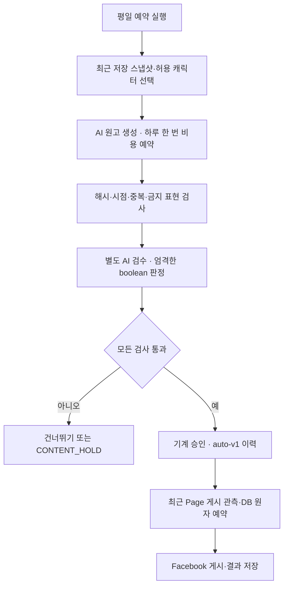

# Market Talk 완전 자동 모드 v2

2026-10-08 KST 사용자 지시로 원고별 사람 승인 요구를 자동 검사로 대체한다. 초기 운영 설정과 결과 불명확 장애의 조사 작업은 별도다. 평일 18:30 KST 1회 주기와 기존 발행 상한은 유지한다.

## 처리

사람은 매 원고를 작성하거나 Evidence/YES를 입력하지 않는다. 자동 원고 생성 1회와 별도 검수 1회, 출력 상한 각각 600/300 토큰이다. SDK 자동 재시도는 없다. 생성은 Page별 KST 날짜 키, 검수는 revision 키로 비용 선예약하여 중복 호출을 막는다. 비용 예약의 불명확 결과·검수 실패를 해결하려고 무한 재생성하지 않는다.

자동 검수자는 `market-talk:auto-v1`로 기록한다. 사람이 검수했다고 표시하지 않는다. 모델 검수는 확률적 검사이며 외부 시세의 사실 검증 또는 오류 없는 카논 판정 보장이 아니다. 자료 변경·중복·만료·부적합 표현은 결정론 검사에서도 차단한다.

## 공개 본문 형식

2026-10-08 사용자 지시로 신규 자동 원고는 `market-talk-2` 형식을 사용한다.
Facebook에 보내는 본문은 잡담 문단, 빈 줄, `캐릭터명 : “대사”`만 포함한다.
제목·시장 수치 원문·조회 시각·출처 링크·내부 안내·면책 문구는 공개 본문에 추가하지 않는다.
근거·시점·카논·검수 정보는 payload와 감사 이력에 유지하며 검증·중복·비용·게시 게이트는 동일하다.
기존 `market-talk-1` 원고의 본문과 revision은 그대로 유지한다. 기존 승인 원고를 바꿀 때는
hold 후 신규 형식의 DRAFT를 등록하고 새 revision을 검수·승인해야 한다.
파일럿은 모의 공급자가 실제 전달 본문을 캡처하고 재실행 시 한 번만 전송되는지 확인한다.
외부 Facebook 공개 게시와 실제 모델 검수 성공은 별도 검증이다.

## 자료 선택 기준

`icg_side.main_feed_market_v1`의 현재 KST 날짜 이하 최신 1행을 읽는다. 3일 초과 자료, 누락·비유한 수치, 비정상 VIX/Fear & Greed는 거부한다. 허용 캐릭터를 날짜에 따라 순환한다. 원고에는 저장 스냅샷의 수치를 그대로 제시하고, DB 조회 시각과 저장 기준일을 구분한다. GitHub 링크는 해당 읽기 뷰 정의의 출처이며 실제 수치를 공개한 데이터셋 링크로 주장하지 않는다. 원본 공급자 시세를 추가로 재조회하는 기능은 없다.

같은 자료의 의미 키가 최근 원고와 같으면 생성 전에 건너뛴다. 같은 날짜의 등록된 자동 원고가 있으면 새 글을 생성하지 않고 상태를 따른다. 게시 완료 원고와 CONTENT_HOLD 원고는 재생성하지 않는다. 승인된 원고의 재실행은 최종 발행 게이트를 통과해야 한다.

## 다른 앱·수동 게시와 공존

기존 `exclusive_managed`는 사실과 다르게 true로 기록하지 않는다. 신규 `coexistence_allowed=true`로 공존을 명시적으로 허용할 수 있다. 기본값은 false다. 공존 모드도 Page enabled, 최근 관측, 미해결 SENDING/UNKNOWN 차단, 발행 수·간격, 동일 본문과 승인·시각 검사 모두 유지한다.

외부 앱이나 사람이 최근 목록 조회 이후 동시에 올리는 게시까지 DB 행 잠금으로 막을 수는 없다. 따라서 공존 모드의 전체 Page 한도는 **관측된 게시를 합산한 제한**이고 모든 외부 게시 경로의 동시성 보장이 아니다. 통합 제어 안의 게시끼리는 원자 예약이 유지된다. 다른 게시가 많아 제한에 걸리면 Market Talk는 글을 밀어 넣지 않고 중단한다.

## 최초 설정

기존 Secret SUPABASE_URL/SUPABASE_KEY/FACE_PAGE_ID/FACE_PAGE_TOKEN/ANTHROPIC_API_KEY를 사용한다. Secret 값은 문서나 코드에 입력하지 않는다.

| GitHub Variable | 값 |
|---|---|
| MARKET_TALK_CHARACTER_IDS | CHAR_HERO_001 또는 승인된 ID 목록 |
| MARKET_TALK_AUTO_ENABLED | true |
| MARKET_TALK_MODEL | 확인된 모델 ID |
| MARKET_TALK_INPUT_USD_PER_MTOK | 해당 모델 입력 USD/백만 토큰 |
| MARKET_TALK_OUTPUT_USD_PER_MTOK | 해당 모델 출력 USD/백만 토큰 |
| FACEBOOK_CONTROL_ENABLED | true |
| MARKET_TALK_LIVE | true |
| MARKET_TALK_SCHEDULE_ENABLED | 실제 1건 베타 후 true |

기존 외전 기본 모델 `claude-sonnet-4-6`를 사용하는 경우, 2026-10-08 확인된 공식 단가는 입력 3 / 출력 15 USD per million tokens다. [공식 모델 문서](https://platform.claude.com/docs/en/models/sonnet-4-6/overview). 다른 모델의 단가를 그대로 쓰지 않는다.

DB 변경은 `20261007151940_market_talk_automatic.sql`을 적용한다. Page 정책 `enabled`, `coexistence_allowed`, 일/월 생성 예산을 설정해야 한다. 초기 점검 당시 일/월 예산은 0이며 이번 개발에서 임의로 예산을 늘리지 않는다. 예산 예시: 일 USD 0.10 / 월 USD 2.00은 **제안 상한**이며 실제 설정·사용액이 아니다. 보수적 선예약 비용이 잔여 상한을 넘으면 모델을 호출하지 않는다.

수동 workflow 테스트: stage=automate, revision/Evidence 비움. confirm 비움은 생성·기계 승인까지만 처리하고 공개 게시하지 않는다. 생성은 유료다. confirm=YES는 자동 생성부터 실제 게시까지 요청한다. 예약 이벤트는 AUTO_ENABLED=true일 때 automate를 선택하며 live를 요청한다. 실제 플래그가 꺼져 있으면 live 자동화는 비용 호출 전에 중단한다.

## 검증과 운영 완료 구분

오프라인 검증: 자동 생성/승인·모델 검수 탈락·변경된 자료·예산 0·자료 누락/오래됨·동일 원고 재실행·검수 JSON 엄격성·비용 키 재사용 및 SQL 공존 opt-in·동시 전송 차단을 확인한다. 기존 발행과 경계 회귀도 확인한다.

코드 반영, DB 마이그레이션, GitHub Variable 활성화, 실제 모델·Facebook 운영 베타 성공은 각각 별도의 완료 항목이다. 코드만으로 운영 100% 활성화를 선언하지 않는다. 이전 베타 원고는 2026-10-07 23:59 KST에 만료되어 신규 자동화 테스트에 재사용하지 않는다.

UNKNOWN/SENDING 결과는 자동 재전송하지 않는다. 운영자가 정확한 실제 게시 또는 미게시를 확인한 후 기존 reconcile/resume 절차를 사용한다. 이는 정상 원고별 휴먼게이트가 아니라 불명확한 외부 전송의 예외 복구다.
